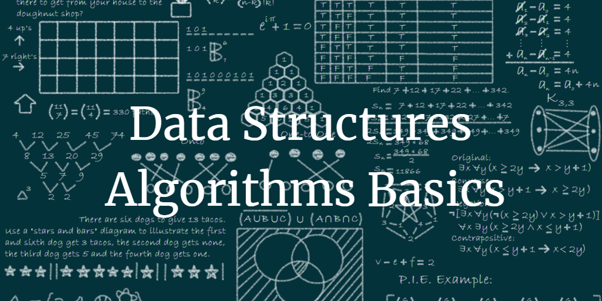

   

# dsa 
 data structures and algorithms

* Hash functions  
  - separate chaining

* SIngle linked list  
  - push/pop
  - insert/delete
  - append
* Binheap  
  - minheapify
  - maxheapify
  - biuld tree
  - insert/delete
  - traverse: pre/in/post order
 

